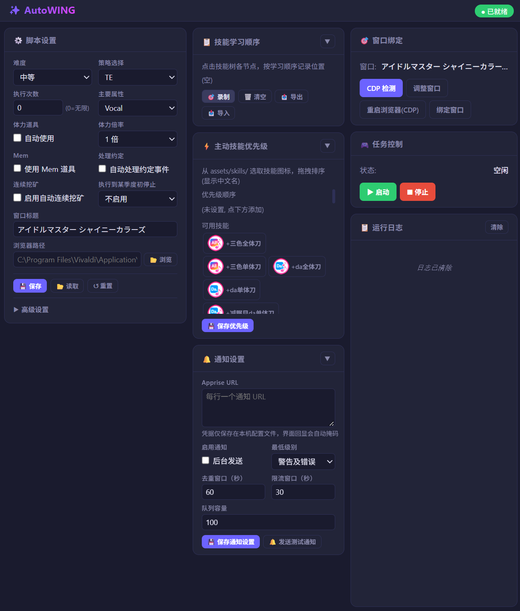
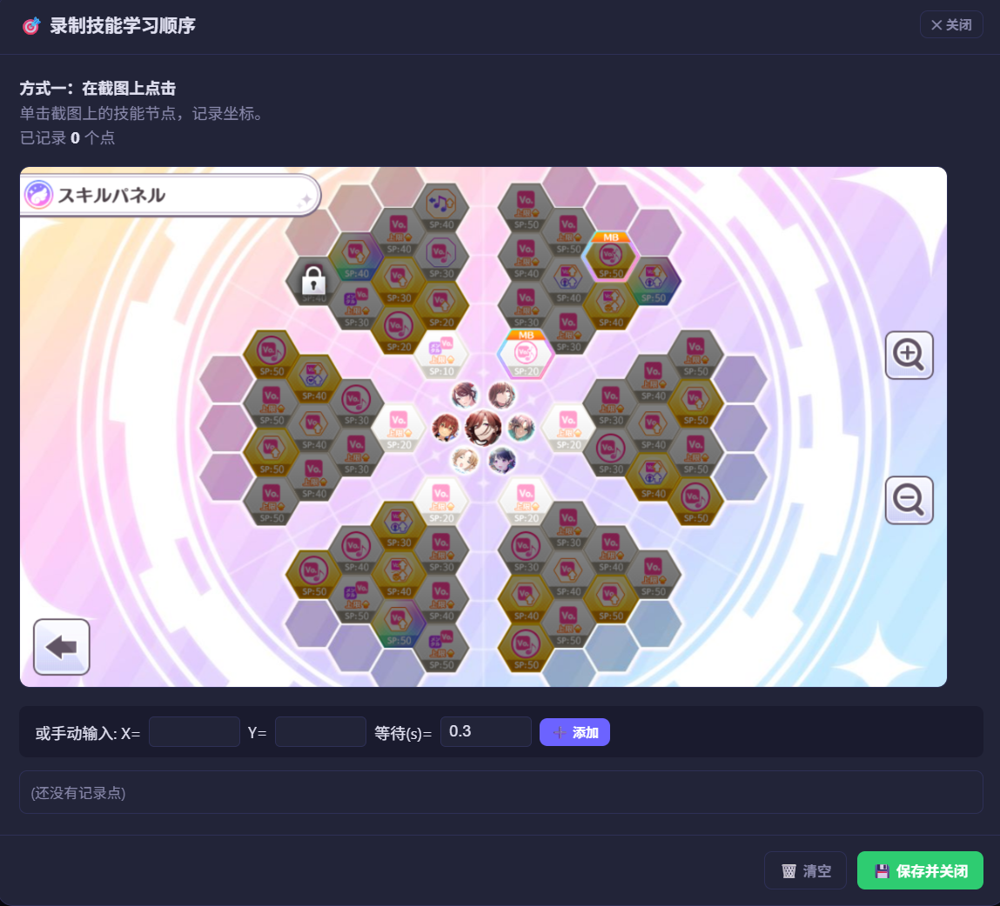

# AutoWING 使用指南

**当前版本：v0.1.6-alpha**

AutoWING 是一款用于《偶像大师 闪耀色彩》（enza 版，页游）的自动育成工具。它能自动帮你完成「育成前配置 → 四季度育成 → 结算」的完整育成循环，全程后台运行，不干扰你使用电脑。

本指南面向最终用户，不涉及任何技术细节。

---

## **使用须知**

在使用 AutoWING 前，请仔细阅读以下条款：

1. **非官方工具**：AutoWING 是第三方开发的辅助工具，与游戏官方无关。

2. **工具定位**：本工具通过识别游戏画面模拟常规交互操作，旨在简化重复性操作。本工具不会修改任何游戏文件或数据。本工具免费提供，仅供学习与交流使用，请勿用于商业或营利性目的。

3. **使用风险**：使用自动化工具存在账号封禁风险，请用户自行评估后决定是否使用。因使用本工具导致的任何账号损失，开发者不承担相关责任。

4. **按现状提供**：本工具“按现状”提供，不保证完全无 bug 或 100% 稳定运行。开发者将持续维护优化，但不承诺任何特定功能或兼容性。

5. **免责范围**：在任何情况下，开发者均不对因使用或无法使用本工具所导致的任何直接或间接损失承担责任。

6. **合规义务**：用户应自行了解并遵守游戏官方的利用规约，本工具的使用决定及后果由用户自行承担。

---

## **重要建议**
为了获得更稳定的自动化体验，建议在首次使用前注意以下几点：

1. **游戏窗口保持前台激活**：运行期间请勿最小化游戏窗口或切换到其他标签页或在前台开启其他最大化窗口，否则浏览器节流策略可能导致操作超时或判定失败。
2. **修改设置后务必保存**：每次调整控制面板上的参数后，记得先点击「保存」，再启动任务，否则修改不会生效。
3. **将记事本道具标星**：由于该自动化工具在育成中选项选择高度依赖记事本道具的选项结果展示，强烈建议将记事本道具标星并且开启「使用 mem」的设置。
4. **建议在部分特定页面启动任务**：工具具备一定的页面自适应能力，但为避免误道具或断点启动时行为出现错误，强烈建议在点击「启动」前，手动将游戏停留在「剧本选择」（プロデュース選択）页面，或停留在育成中的某季度起始周。
5. **遇到卡顿先调大等待偏移**：如果网络或游戏响应偏慢，优先尝试将「等待时间修正」调大，通常能提升稳定性。若只有育成前的页面加载时间较长，可以只调整「育成前额外偏移」。
6. **浏览器兼容性说明**：本工具推荐使用 Vivaldi 或 Thorium 浏览器。Chrome、Edge 等常见浏览器因自身安全策略限制，无法正常建立 CDP 连接，请勿使用。

---

## 一、安装

1. 解压收到的压缩包到任意目录（路径中**不要包含中文**）。
2. 双击文件夹里的 `AutoWING.exe` 启动。
3. 稍等片刻，会弹出 AutoWING 的控制面板窗口。

> 首次运行提示：Windows 可能会提示“未知发布者”，这是因为本工具未进行代码签名，属于正常现象。点击「仍要运行」即可，工具不含任何恶意代码。

### 更新

#### 如何更新

1. 下载最新版本的压缩包
2. 解压到 **原安装目录**，选择「全部覆盖」
3. 启动 `AutoWING.exe`

> 你的配置文件（`_internal/configs/strategy.json`）和日志文件不会丢失，可以放心覆盖。
> 如需备份，复制 `_internal/configs/` 文件夹即可。

---

## 二、快速开始

### 第 1 步：准备 CDP 浏览器窗口

- 如果当前没有已开启 CDP 调试端口的浏览器窗口，点击 **「重启浏览器(CDP)」** 按钮，工具会自动启动一个带调试端口的浏览器实例并打开游戏标签页。
- 若已有带 CDP 端口的浏览器窗口，可直接跳过此步骤。

> 启动任务时工具会自动建立 CDP 连接，无需手动检测。如排查问题时需确认连接状态，可点击 **「CDP 检测」** 验证。窗口未关闭则 CDP 端口会一直保持可用。

### 第 2 步：配置基础设置

*▲ AutoWING 控制面板，所有配置都在这里完成*

根据您的育成目标，配置以下核心参数：

| 必配项 | 建议 |
|--------|------|
| **策略选择** | 挖矿选 `TE`；追求粉丝数选 `140` 或 `230` |
| **主属性** | 根据支援卡与育成偶像属性选择 |
| **难度** | 卡片强度足够时可选 `困难` |

其他设置项（体力道具、体力倍率、Mem、处理约定）按个人需求选择，详见下方「设置详解」。

### 第 3 步：启动任务

1. 点击 **「▶ 启动」** 按钮，工具会自动连接 CDP 并开始执行育成流程
2. 观察运行日志，确认脚本正常推进
3. 如需中途停止，点击 **「■ 停止」** 按钮即可

## 三、设置详解

### 基础设置

| 设置项 | 说明 |
|--------|------|
| 难度 | `普通` / `困难` |
| 策略选择 | 育成打法：`TE` = 以50万粉丝与最终视镜导向的“挖矿”育成；`140` / `230` = 以视镜为主的粉丝数导向育成，数值对应目标粉丝数 |
| 执行次数 | 育成多少轮后自动停止。`0` = 无限运行 |
| 主属性 | 课程偏重方向：`vocal` / `da` / `vi` / `radio` / `photo` |
| 体力道具 | 体力不足时是否自动使用90回复的体力道具 |
| 体力倍率 | `1` / `3` 倍体力消耗 |
| 使用 mem | 是否使用 秘密のメモ帳(记事本) 道具 |
| 处理约定 | 是否接受并自动处理育成内的约定，若关闭则自动拒绝约定 |
| 自动连续挖矿 | 当育成策略为 `TE` 时，开启后每次进行育成编成时会自动将育成偶像切换为第一个未完成 te 任务的偶像 |
| 执行到某季度初停止 | 当启用该选项时，工具将会在该季度首次调用策略进行操作前停止流程 |
| 浏览器路径 | 自定义浏览器可执行文件位置。留空时工具按 Vivaldi → Thorium 顺序自动检测已安装的浏览器 |

> 记事本道具是自动处理剧情选项的重要工具，在不拥有 283パス(小月卡) 时强烈建议勾选使用 mem

### 高级设置

| 设置项 | 说明 |
|--------|------|
| 等待时间修正 | 给所有等待动作增加一个固定偏移（秒），游戏卡顿或网络流畅度不佳时可适当调大 |
| 育成前额外偏移 | 「确认剧本 → 确认编队」的额外等待偏移 |
| 循环间隔 | 主循环的间隔（秒），网络状况不佳时可以略微调大 |
| QTE间隔时长偏移 | 视镜内QTE行动间隔点击的时长偏移 |

### 技能学习顺序

- 配置学习顺序前需进入对应编成队伍下的 スキルパネル(技能面板) 页面，**并且点击 缩小按钮(-) 将面板缩至最小**，以供录制按钮点按时获得正确截图
- 点击「录制」：在弹出的截图上依次点击要学习的技能位置，保存后工具会按这个顺序自动学习。
- 支持「导出 / 导入」：把录好的顺序备份或分享给其他玩家。

*▲ 在弹出的截图上依次点击要学习的技能*

> 注意主动技能栏位上限，避免主动技能被意外覆盖

### 技能优先级

从可用技能列表中，把想优先使用的技能排到最前面。视镜中工具会按此优先级选择技能。

> 区别说明：「技能学习顺序」控制育成中学哪些技能、按什么顺序学；「技能优先级」控制视镜中用哪些技能、按什么顺序用。
> 列表排序决定视镜中的技能选择顺序。例如把 `vo_aoe` 放置于最前，视镜中 buff 数量足够的回合会优先使用它。
> 如果某个技能不在列表中，视镜中不会主动使用。

### 通知设置

通知设置位于控制面板中间栏的两个技能卡片下方。三个卡片默认收起，点击标题右侧按钮即可展开或收起。

| 设置项 | 说明 |
|--------|------|
| 启用通知 | 开启后台通知发送。关闭时不会发送任何通知 |
| Apprise URL | 每行填写一个 Apprise URL，可配置 Telegram、Discord、钉钉、ntfy、Windows 原生通知等渠道 |
| 最低级别 | 默认是「警告及错误」；也可以选择「仅错误」或「全部通知」 |
| 去重窗口 / 限流窗口 | 防止循环异常或重复状态连续刷屏，单位为秒 |
| 队列容量 | 后台待发送通知的最大数量，队列满时新通知会被丢弃并记录日志 |

通知 URL 的凭据会保存在本机配置文件中，但控制面板回显时会自动掩码。保存未修改的掩码内容不会覆盖原始 URL。点击「发送测试通知」只会将测试事件放入后台队列，不等待渠道实际送达。

**Apprise URL 示例**

以下是常用渠道的填写示例，每行一个 URL，可同时配置多个渠道：

| 渠道 | 示例 URL | 凭据获取位置 |
|------|----------|--------------|
| Telegram | `tgram://<bot_token>/<chat_id>` | BotFather 创建机器人获取 token；`getUpdates` 获取 chat_id |
| Discord | `discord://<webhook_id>/<webhook_token>` | 频道设置 → 整合 → Webhook |
| 钉钉 | `dingtalk://<access_token>` | 群设置 → 智能群助手 → 添加机器人 |
| ntfy | `ntfy://<topic>` | 自建服务或 [ntfy.sh](https://ntfy.sh) 的 topic |
| Bark | `bark://<hostname>/<device_key>` | Bark App 中复制 URL，取域名后的 key 部分  |
| Bark（自建 HTTPS） | `barks://<hostname>/<device_key>` | 同上，自建服务器且启用 SSL 时使用  |
| Windows 原生通知 | `windows://` | 无需凭据 |

> 其他渠道及完整 URL 语法见 [Apprise 官方文档](https://github.com/caronc/apprise)。

## 四、它会做什么

启动后，AutoWING 会自动循环处理：

1. **育成前**：自动切换育成剧本为 WING 、选难度、设体力倍率、配置记事本道具、视需要使用体力道具，然后点开始。
2. **育成中**：按季度推进，每周检测当前状态——
   - 选择日程
   - 季度任务 / 约定到期时优先处理
   - 体力不足时安排休息
   - 进入视镜时自动进行视镜操作
3. **技能学习**：在第一次进入视镜前自动按你录制的顺序学习技能。
4. **育成结束**：跳过结算动画，自动进入下一轮（直到达到执行次数或手动停止）。

整个过程在后台进行，鼠标不在游戏窗口上也能正常操作。**运行期间请尽量不要手动操作浏览器页面**，否则可能导致状态判断错乱。

## 五、注意事项

- 为确保脚本正常运行，请始终保持游戏标签页激活，并将浏览器窗口置于前台。后台标签页或窗口可能因浏览器节流策略导致操作超时或判定失败。
- 建议育成期间不要切换浏览器标签或最小化游戏窗口。
- 电脑息屏 / 睡眠前先点「停止」，避免状态失联。
- 日志会记录每一步操作，卡住时先看日志，再点「停止」和「启动」重试。

## 六、常见问题

| 问题 | 解决办法 |
|------|----------|
| 点「启动」没反应 | 先确认游戏标签页为激活的标签页并且「CDP 检测」成功；再看日志里的错误提示 |
| 修改设置后运行没变化 | 修改完设置后记得先点「保存」，再重新启动。设置保存后才能生效。 |
| 一直提示「CDP 无法连接」 | 确认游戏标签页为激活的标签页，若仍无法连接，点「重启浏览器(CDP)」后重新检测 |
| 育成到某季度后不动了 | 查看日志定位卡在哪一步；检查该季度的策略/技能学习顺序是否配置 |
| 技能学习乱点 / 不学 | 确认录制时截图是否正确显示，重新「录制」技能学习顺序，或「清空」后重录 |
| 想要更稳的节奏 | 把「等待时间修正」调大 0.1~0.3 秒 |
| 想让它跑完自动停止 | 「执行次数」设为 1，跑完这轮即停 |

## 更新日志

### v0.1.6-alpha (2026-10-05)

**新增功能**
- 增加了对分屏状态下的游戏画面适配
- 增加了执行直到某季度初的设置项

**修复**
- 修复了部分剧情背景图错误识别为主页面的问题
- 修复了在进入视镜前画面出现报错时脚本流程卡死的问题

**优化**
- 优化了进入技能学习页面操作的稳定性

### v0.1.5-alpha (2026-10-05)

**新增功能**
- 增加了通知功能，开启后可以选择具体的提醒方式，并更新了控制面板

**修复**
- 修复了视镜中意外呼出评委详情页面后无法主动关闭页面的问题
- 修复视镜内跳转计数在季度切换时会被清空的问题

**优化**
- 优化了技能学习退出操作的稳定性

### v0.1.4-alpha.3 (2026-09-15)

**修复**
- 修复了选择使用 mem 并在道具配置流程中未检测到 mem 时，在没有记事本的情况下开始育成的问题。
- 修复了育成中休息操作后剧情跳过行为会被意外中断的问题。
- 修复了视镜中选择 live skill 时，小概率因为被动技能动画遮挡导致技能未选中并呼出评委状态栏导致卡死的问题
- 修复了育成结束后未能正常计数已完成育成次数的问题

**优化**
- 微调了育成前部分行为的顺序，优化了在育成前页面启动时的页面识别能力，减少道具误用风险
- 微调了控制台弹窗的描述
- 优化了视镜内回合开始的检测逻辑，提高识别准确率
- 优化了育成内课程选择页面的检测逻辑，减少误判

### v0.1.4-alpha.2 (2026-09-06)

**优化**
- 优化了部分行为后的等待时间，提升了稳定性与运行效率
- 新增自动连续挖矿选项，若当前育成策略为 `TE` ，开启后每次新进行育成编成时会自动将育成偶像切换为第一个未完成 te 任务的偶像

### v0.1.4-alpha (2026-08-20)

**修复**
- 修复了事件选项有时未能正确识别的问题
- 修复了无法识别体力道具的问题

**优化**
- 优化了技能录制时截图的加载速度
- 优化了视镜QTE的点击稳定性

## 技术限制说明

- 本工具基于图像模板匹配与 CDP 协议实现，运行效果受游戏画面渲染、窗口大小、网络延迟等因素影响，不同环境下可能存在差异。
- 当前版本持续迭代中，部分功能可能尚不稳定，如遇异常可查看日志反馈给开发者。